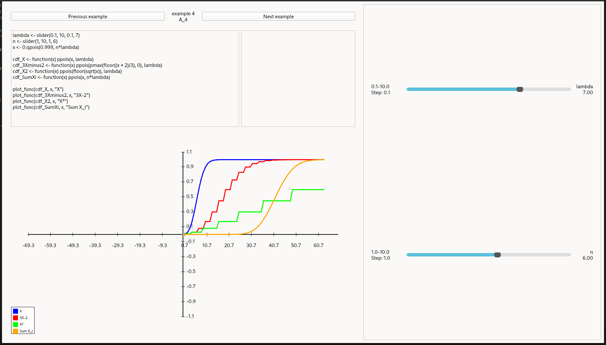

# Interactive R graph visualizer

# Features
* Support for full R environment
* Real-Time Graph Plotter
    * as many lines on a single graph as you want
    * 6 predefined line colors and many randomly generated ones
    * Color legend
    * dynamic graph scaling
* custom R functions
    * INPUT:
        * slider(min, max, [step], [default])
            * NOTE: this function cannot take variables as inputs. Just int/float literals.
    * OUTPUT:
        * plot_line(xs, ys, [name])
        * plot_func(func, xs, [name])
* code editor
* dynamic sliders based on the code
* logging window
* examples carousel

# Dependencies:
* python3
    * PyQt6
* R

