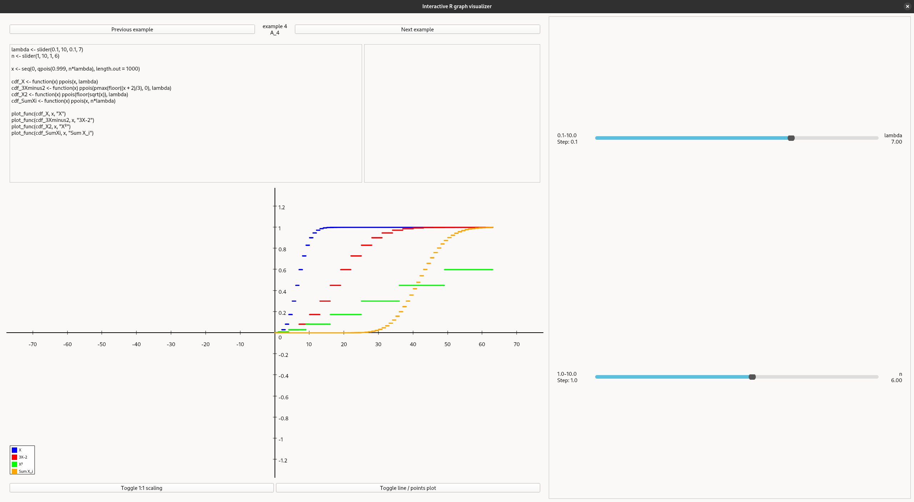
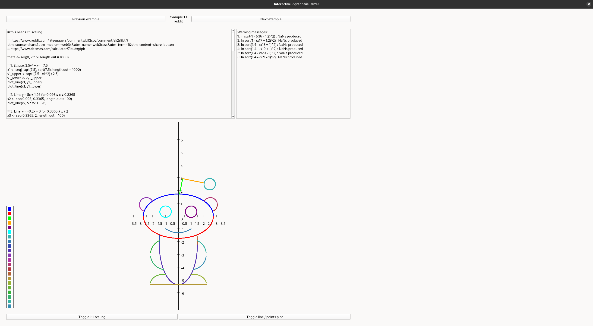
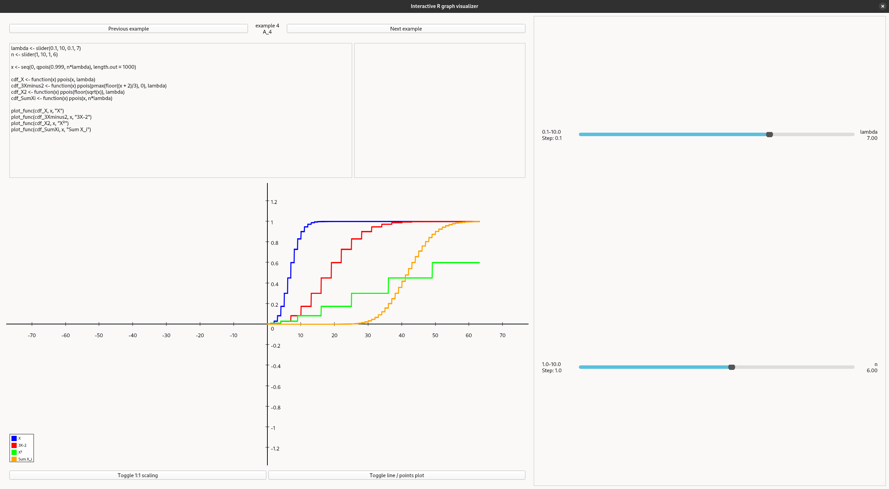

# Problema II
### Cerința [în original](https://github.com/Dragos-Florin-Pojoga/Proiect_PS/blob/main/tema_de_proiect.pdf) (paginile 2-3)

# Vizualizator interactiv de grafice generate de R

# Funcționalități
* Suport complet pentru mediul R
* *Randarea* de grafice în timp real
    * plot cu linii sau cu puncte
    * mai multe linii pe același grafic
    * scalare dinamică sau fixată a graficului
    * legendă de culori
    * 6 culori predefinite și multe altele generate aleator pentru fiecare linii din grafic
* funcții definite în R
    * INPUT:
        * slider(min, max, [step], [default])
            * NOTĂ: această funcție nu poate primi variabile ca intrări. Doar numere de tip int/float.
    * OUTPUT:
        * plot_line(xs, ys, [name])
        * plot_func(func, xs, [name])
* editor de cod
* glisoare dinamice bazate pe codul R
* fereastră de output și erori
* carusel cu exemple

# Dependențe:
* python3
    * PyQt6
* R

# Descriere

Problema se poate împărți în trei subprobleme:
1) să construim o aplicație [Shiny](https://shiny.posit.co/r/getstarted/shiny-basics/lesson1/)

Shiny este o librărie pentru R ce creează aplicații web interactive. Această librărie practic "compilează" codul de R pentru interfață în html, css și js iar codul pentru generarea graficelor este rulat la nevoie pentru a produce imagini ce sunt inserate înapoi în pagină. Acest proces este extrem de complex, ceea ce se reflectă în dimensiunea proiectului: ~115000 de linii de cod scrise de 88 de persoane pe decursul a 13 ani (proiectul a început în 2012)

**Cerința suplimentară:** Construiți o aplicație cu funcționalitățile din Shiny, fără a folosi librăria Shiny

Pentru a crea o aplicație cu o parte din funcționalitatea acestei librării, am ales să folosesc python și cât mai puține librării externe, în final având doar una singura: [PyQt6](https://pypi.org/project/PyQt6/) o librărie cross-platform ce permite crearea de interfețe grafice modulare

Modul de funcționare al acestei aplicații poate fi descris, pe scurt, astfel:
- Așteptăm ca user-ul să facă modificări în cod
- Verificăm dacă codul pentru glisoare a fost modificat, caz în care regenerăm toate glisoarele
- altfel continuăm la pasul următor
- Înlocuim apelurile pentru glisoare cu valorile lor din interfața grafică
- Rulăm codul R în interpretorul din background
- Capturăm răspunsul și îl pregătim pentru afișare
- *Randăm* rezultatul obținut în funcție de starea curentă a aplicației (plot de puncte sau linii)
- Afișăm restul output-ului în fereastra corespunzătoare
- Reluăm întreg procesul de la început

Dificultăți întâlnite în dezvoltarea aplicației:
- optimizarea performanței cât mai mult pentru rularea în timp real a graficelor
    - în special transferul de date dintre R și Python
- interacțiunea bidirecțională cu mediul R
    - prevenirea și tratarea erorilor
    - simularea unei librării native în R
- reprezentarea dinamică a graficelor
    - reprezentarea functiilor discontinue
    - calculul scalării automate
- interacțiunea consistentă și intuitivă cu utilizatorul
    - găsirea celui mai apropiat pas valid la click/drag pe glisor
    - interacțiunea atât cu cursorul cât și cu tastatura
    - reprezentări intuitive a graficelor
    - un API ușor de folosit

2) să reprezentăm grafic funcțiile de repartiție a unor variabile aleatoare

**și**

3) să afișăm anumite funcții cu parametri particularizabili de către utilizator și să calculăm și media și varianța pentru variabila aleatoare corespunzătoare

Pentru rezolvarea acestor probleme, am scris rezolvări în fișiere separate folosind R, funcțiile definite de aplicația noastră de la punclutl `1)` și cunoștiințele predate la curs și seminar, despre funcțiile standard din R, variabile aleatoare, medie și varianță.

Deoarece codul a fost scris pentru aplicația de la punctul `1)`, toate rezolvările au reprezentări grafice interactive.

# Concluzii

În urma acestui proiect, am înțeles mult mai bine cum funcționează limbajul R, ecosistemul lui și avantajele pe care le are față de alte limbaje, creându-ne astfel o idee despre când și unde ar trebui să îl folosim.

Implementarea actuală acoperă toate task-urile propuse în cerința problemei și rezolvă cerințe suplimentare ce nu sunt esențiale pentru rezolvarea problemei inițiale.

Cerințele suplimentare sunt precizare în mare parte în secțiunile "Cerința suplimentară" și "Dificultăți" de la `1)` și evitarea librăriilor specializate deoarece acestea ar face implementarea trivială:

Pentru python există librăriile [rpy2](https://rpy2.github.io/) (integrare nativă între R și python) și [Matplotlib](https://matplotlib.org/) (generare avansată de grafice). Integrarea acestor librării într-un pipeline simplu ar rezolva aproape întreaga problemă, singurul aspect ce ar mai trebui abordat ar fi input-ul de la utilizator ce se poate face foarte simplu folosind anumite librării sau ignorarea acestei probleme și rularea aplicației folosind [Jupyter](https://jupyter.org/)

# Galerie

